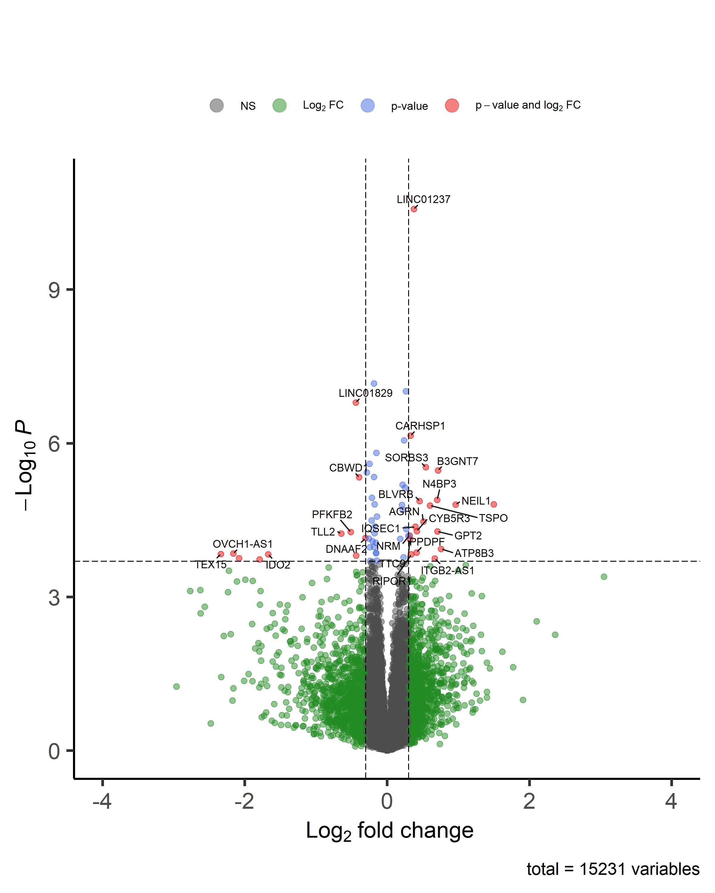
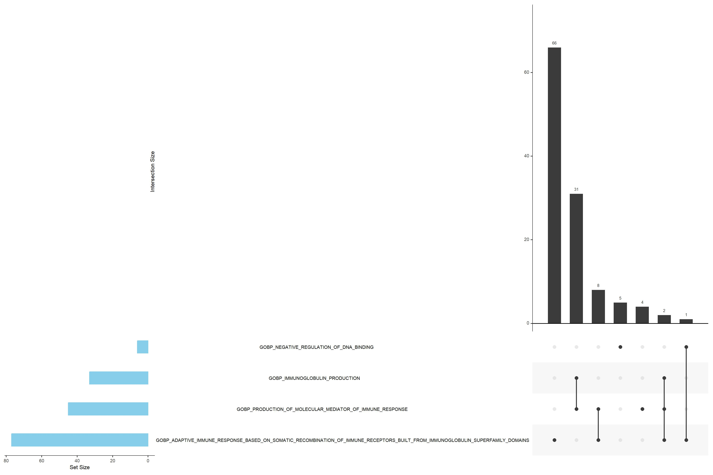

```{r setup, include=FALSE}
knitr::opts_chunk$set(echo = TRUE)
```

The purpose of this vignette is to complement, describe and explain the
scripts created for my master thesis project, in which RNAseq data from
31 different individuals undergoes different analyses.

# How does the data look?

We have RNAseq data from 31 different individuals of 8 different
families with high number of Bipolar Disorder affected relatives. They
have two different IDs: the individual ID present in the databank of the
group and the sample ID used for the RNAseq itself.

| Databank ID | RNAseq ID | Condition  | Gender | Age   | Family |
|-------------|-----------|------------|--------|-------|--------|
| 21873       | BWH011    | Affected   | Male   | adult | 210    |
| 12005       | BWH002    | Unaffected | Male   | elder | 120    |
| 12001       | BWH003    | Unaffected | Male   | adult | 120    |
| 12002       | BWH004    | Unaffected | Male   | adult | 120    |
| 12003       | BWH005    | Affected   | Female | adult | 120    |
| 12004       | BWH006    | Affected   | Female | adult | 120    |
| 21769       | BWH007    | Affected   | Male   | adult | 172    |
| 21768       | BWH008    | Unaffected | Female | adult | 172    |
| 21770       | BWH009    | Affected   | Female | young | 172    |
| 21771       | BWH010    | Affected   | Female | young | 172    |
| 12504       | BWH012    | Unaffected | Male   | elder | 125    |
| 12500       | BWH013    | Unaffected | Female | elder | 125    |
| 12506       | BWH014    | Affected   | Male   | adult | 125    |
| 2701        | BWH015    | Unaffected | Male   | elder | 27     |
| 2700        | BWH016    | Affected   | Female | elder | 27     |
| 2705        | BWH017    | Affected   | Female | young | 27     |
| 2706        | BWH018    | Affected   | Male   | adult | 27     |
| 2707        | BWH019    | Unaffected | Female | adult | 27     |
| 7203        | BWH000    | Affected   | Male   | young | 72     |
| 7204        | BWH001    | Affected   | Male   | young | 72     |
| 7201        | BWH020    | Unaffected | Male   | elder | 72     |
| 7200        | BWH021    | Unaffected | Female | elder | 72     |
| 7202        | BWH022    | Affected   | Male   | young | 72     |
| 12709       | BWH023    | Unaffected | Male   | elder | 127    |
| 12700       | BWH024    | Unaffected | Female | elder | 127    |
| 12708       | BWH025    | Affected   | Male   | young | 127    |
| 6504        | BWH026    | Affected   | Male   | elder | 65     |
| 6506        | BWH027    | Unaffected | Female | elder | 65     |
| 6502        | BWH028    | Unaffected | Male   | adult | 65     |
| 6503        | BWH029    | Unaffected | Female | adult | 65     |
| 6500        | BWH030    | Affected   | Male   | adult | 65     |

The pedigree family structures is the following:

(insertar imagen pedigris)

# Data processing in bash

## Preprocessing of reads

The original fastq files come in three files for running files, that had
to be concatenated.

```{bash eval = FALSE}
#!/bin/bash
cd /home/proyectos/genpsych/RNAseq/RNAseq_FastaQ/
for d in BWH--[0-9][0-9][0-9]
do
	cd $d
	#Uncompress
	gunzip -c *R1.fastq.gz > $d_R1.fastq
	gunzip -c *R2.fastq.gz > $d_R2.fastq
	#Move to my folder
	mv *fastq ../fastqInes	
	cd ..
	echo continuing
done
```

A first fastQC assay was done, using the program with the same
name[@andrews2010]:

```{bash eval = FALSE}
#!/bin/bash
module load fastqc/0.11.9
fastqc *fastq -t 20 -o FASTQC
```

Though the overall quality of the reads was very good, I decided to trim
a little bit the ends using Trimmomatic[@bolger2014]. To generate the
commands for each sample the script used was:

```{bash eval = FALSE}
#!/bin/bash
for i in `ls -1 *R1.fastq | sed 's/\_R1.fastq//'`; 
do 
echo java -jar /usr/local/trimmomatic/0.39/trimmomatic-0.39.jar PE -threads 20 
-phred33 $i\_R1.fastq $i\_R2.fastq $i\_R1_paired.fq.gz $i\_R1_unpaired.fq.gz $i\_R2_paired.fq.gz $i\_R2_unpaired.fq.gz 
SLIDINGWINDOW:4:20 MINLEN:50 >> trim_cmd; 
done
```

The command first has to call to java and declare that it is a paired
end (*PE*) experiment. The sliding window (*SLIDINGWINDOW:4:20*) in
trimmomatic means that it will scan the read from the 5' end in groups
of **4** and when the average quality drops from **20** it will clip it.
We will only accept reads with a minimum length (*MINLEN:50*) of 50
basepairs.

Giving the following whole script:

```{bash eval = FALSE}
#!/bin/bash
module load trimmomatic/0.39

java -jar /usr/local/trimmomatic/0.39/trimmomatic-0.39.jar PE -threads 20 -phred33 BWH--000_R1.fastq BWH--000_R2.fastq BWH--000_R1_paired.fq.gz BWH--000_R1_unpaired.fq.gz BWH--000_R2_paired.fq.gz BWH--000_R2_unpaired.fq.gz SLIDINGWINDOW:4:20 MINLEN:50

java -jar /usr/local/trimmomatic/0.39/trimmomatic-0.39.jar PE -threads 20 -phred33 BWH--001_R1.fastq BWH--001_R2.fastq BWH--001_R1_paired.fq.gz BWH--001_R1_unpaired.fq.gz BWH--001_R2_paired.fq.gz BWH--001_R2_unpaired.fq.gz SLIDINGWINDOW:4:20 MINLEN:50

java -jar /usr/local/trimmomatic/0.39/trimmomatic-0.39.jar PE -threads 20 -phred33 BWH--002_R1.fastq BWH--002_R2.fastq BWH--002_R1_paired.fq.gz BWH--002_R1_unpaired.fq.gz BWH--002_R2_paired.fq.gz BWH--002_R2_unpaired.fq.gz SLIDINGWINDOW:4:20 MINLEN:50

java -jar /usr/local/trimmomatic/0.39/trimmomatic-0.39.jar PE -threads 20 -phred33 BWH--003_R1.fastq BWH--003_R2.fastq BWH--003_R1_paired.fq.gz BWH--003_R1_unpaired.fq.gz BWH--003_R2_paired.fq.gz BWH--003_R2_unpaired.fq.gz SLIDINGWINDOW:4:20 MINLEN:50

java -jar /usr/local/trimmomatic/0.39/trimmomatic-0.39.jar PE -threads 20 -phred33 BWH--004_R1.fastq BWH--004_R2.fastq BWH--004_R1_paired.fq.gz BWH--004_R1_unpaired.fq.gz BWH--004_R2_paired.fq.gz BWH--004_R2_unpaired.fq.gz SLIDINGWINDOW:4:20 MINLEN:50

java -jar /usr/local/trimmomatic/0.39/trimmomatic-0.39.jar PE -threads 20 -phred33 BWH--005_R1.fastq BWH--005_R2.fastq BWH--005_R1_paired.fq.gz BWH--005_R1_unpaired.fq.gz BWH--005_R2_paired.fq.gz BWH--005_R2_unpaired.fq.gz SLIDINGWINDOW:4:20 MINLEN:50

java -jar /usr/local/trimmomatic/0.39/trimmomatic-0.39.jar PE -threads 20 -phred33 BWH--006_R1.fastq BWH--006_R2.fastq BWH--006_R1_paired.fq.gz BWH--006_R1_unpaired.fq.gz BWH--006_R2_paired.fq.gz BWH--006_R2_unpaired.fq.gz SLIDINGWINDOW:4:20 MINLEN:50

java -jar /usr/local/trimmomatic/0.39/trimmomatic-0.39.jar PE -threads 20 -phred33 BWH--007_R1.fastq BWH--007_R2.fastq BWH--007_R1_paired.fq.gz BWH--007_R1_unpaired.fq.gz BWH--007_R2_paired.fq.gz BWH--007_R2_unpaired.fq.gz SLIDINGWINDOW:4:20 MINLEN:50

java -jar /usr/local/trimmomatic/0.39/trimmomatic-0.39.jar PE -threads 20 -phred33 BWH--008_R1.fastq BWH--008_R2.fastq BWH--008_R1_paired.fq.gz BWH--008_R1_unpaired.fq.gz BWH--008_R2_paired.fq.gz BWH--008_R2_unpaired.fq.gz SLIDINGWINDOW:4:20 MINLEN:50

java -jar /usr/local/trimmomatic/0.39/trimmomatic-0.39.jar PE -threads 20 -phred33 BWH--009_R1.fastq BWH--009_R2.fastq BWH--009_R1_paired.fq.gz BWH--009_R1_unpaired.fq.gz BWH--009_R2_paired.fq.gz BWH--009_R2_unpaired.fq.gz SLIDINGWINDOW:4:20 MINLEN:50

java -jar /usr/local/trimmomatic/0.39/trimmomatic-0.39.jar PE -threads 20 -phred33 BWH--010_R1.fastq BWH--010_R2.fastq BWH--010_R1_paired.fq.gz BWH--010_R1_unpaired.fq.gz BWH--010_R2_paired.fq.gz BWH--010_R2_unpaired.fq.gz SLIDINGWINDOW:4:20 MINLEN:50

java -jar /usr/local/trimmomatic/0.39/trimmomatic-0.39.jar PE -threads 20 -phred33 BWH--011_R1.fastq BWH--011_R2.fastq BWH--011_R1_paired.fq.gz BWH--011_R1_unpaired.fq.gz BWH--011_R2_paired.fq.gz BWH--011_R2_unpaired.fq.gz SLIDINGWINDOW:4:20 MINLEN:50

java -jar /usr/local/trimmomatic/0.39/trimmomatic-0.39.jar PE -threads 20 -phred33 BWH--012_R1.fastq BWH--012_R2.fastq BWH--012_R1_paired.fq.gz BWH--012_R1_unpaired.fq.gz BWH--012_R2_paired.fq.gz BWH--012_R2_unpaired.fq.gz SLIDINGWINDOW:4:20 MINLEN:50

java -jar /usr/local/trimmomatic/0.39/trimmomatic-0.39.jar PE -threads 20 -phred33 BWH--013_R1.fastq BWH--013_R2.fastq BWH--013_R1_paired.fq.gz BWH--013_R1_unpaired.fq.gz BWH--013_R2_paired.fq.gz BWH--013_R2_unpaired.fq.gz SLIDINGWINDOW:4:20 MINLEN:50

java -jar /usr/local/trimmomatic/0.39/trimmomatic-0.39.jar PE -threads 20 -phred33 BWH--014_R1.fastq BWH--014_R2.fastq BWH--014_R1_paired.fq.gz BWH--014_R1_unpaired.fq.gz BWH--014_R2_paired.fq.gz BWH--014_R2_unpaired.fq.gz SLIDINGWINDOW:4:20 MINLEN:50

java -jar /usr/local/trimmomatic/0.39/trimmomatic-0.39.jar PE -threads 20 -phred33 BWH--015_R1.fastq BWH--015_R2.fastq BWH--015_R1_paired.fq.gz BWH--015_R1_unpaired.fq.gz BWH--015_R2_paired.fq.gz BWH--015_R2_unpaired.fq.gz SLIDINGWINDOW:4:20 MINLEN:50

java -jar /usr/local/trimmomatic/0.39/trimmomatic-0.39.jar PE -threads 20 -phred33 BWH--016_R1.fastq BWH--016_R2.fastq BWH--016_R1_paired.fq.gz BWH--016_R1_unpaired.fq.gz BWH--016_R2_paired.fq.gz BWH--016_R2_unpaired.fq.gz SLIDINGWINDOW:4:20 MINLEN:50

java -jar /usr/local/trimmomatic/0.39/trimmomatic-0.39.jar PE -threads 20 -phred33 BWH--017_R1.fastq BWH--017_R2.fastq BWH--017_R1_paired.fq.gz BWH--017_R1_unpaired.fq.gz BWH--017_R2_paired.fq.gz BWH--017_R2_unpaired.fq.gz SLIDINGWINDOW:4:20 MINLEN:50

java -jar /usr/local/trimmomatic/0.39/trimmomatic-0.39.jar PE -threads 20 -phred33 BWH--018_R1.fastq BWH--018_R2.fastq BWH--018_R1_paired.fq.gz BWH--018_R1_unpaired.fq.gz BWH--018_R2_paired.fq.gz BWH--018_R2_unpaired.fq.gz SLIDINGWINDOW:4:20 MINLEN:50

java -jar /usr/local/trimmomatic/0.39/trimmomatic-0.39.jar PE -threads 20 -phred33 BWH--019_R1.fastq BWH--019_R2.fastq BWH--019_R1_paired.fq.gz BWH--019_R1_unpaired.fq.gz BWH--019_R2_paired.fq.gz BWH--019_R2_unpaired.fq.gz SLIDINGWINDOW:4:20 MINLEN:50

java -jar /usr/local/trimmomatic/0.39/trimmomatic-0.39.jar PE -threads 20 -phred33 BWH--020_R1.fastq BWH--020_R2.fastq BWH--020_R1_paired.fq.gz BWH--020_R1_unpaired.fq.gz BWH--020_R2_paired.fq.gz BWH--020_R2_unpaired.fq.gz SLIDINGWINDOW:4:20 MINLEN:50

java -jar /usr/local/trimmomatic/0.39/trimmomatic-0.39.jar PE -threads 20 -phred33 BWH--021_R1.fastq BWH--021_R2.fastq BWH--021_R1_paired.fq.gz BWH--021_R1_unpaired.fq.gz BWH--021_R2_paired.fq.gz BWH--021_R2_unpaired.fq.gz SLIDINGWINDOW:4:20 MINLEN:50

java -jar /usr/local/trimmomatic/0.39/trimmomatic-0.39.jar PE -threads 20 -phred33 BWH--022_R1.fastq BWH--022_R2.fastq BWH--022_R1_paired.fq.gz BWH--022_R1_unpaired.fq.gz BWH--022_R2_paired.fq.gz BWH--022_R2_unpaired.fq.gz SLIDINGWINDOW:4:20 MINLEN:50

java -jar /usr/local/trimmomatic/0.39/trimmomatic-0.39.jar PE -threads 20 -phred33 BWH--023_R1.fastq BWH--023_R2.fastq BWH--023_R1_paired.fq.gz BWH--023_R1_unpaired.fq.gz BWH--023_R2_paired.fq.gz BWH--023_R2_unpaired.fq.gz SLIDINGWINDOW:4:20 MINLEN:50

java -jar /usr/local/trimmomatic/0.39/trimmomatic-0.39.jar PE -threads 20 -phred33 BWH--024_R1.fastq BWH--024_R2.fastq BWH--024_R1_paired.fq.gz BWH--024_R1_unpaired.fq.gz BWH--024_R2_paired.fq.gz BWH--024_R2_unpaired.fq.gz SLIDINGWINDOW:4:20 MINLEN:50

java -jar /usr/local/trimmomatic/0.39/trimmomatic-0.39.jar PE -threads 20 -phred33 BWH--025_R1.fastq BWH--025_R2.fastq BWH--025_R1_paired.fq.gz BWH--025_R1_unpaired.fq.gz BWH--025_R2_paired.fq.gz BWH--025_R2_unpaired.fq.gz SLIDINGWINDOW:4:20 MINLEN:50

java -jar /usr/local/trimmomatic/0.39/trimmomatic-0.39.jar PE -threads 20 -phred33 BWH--026_R1.fastq BWH--026_R2.fastq BWH--026_R1_paired.fq.gz BWH--026_R1_unpaired.fq.gz BWH--026_R2_paired.fq.gz BWH--026_R2_unpaired.fq.gz SLIDINGWINDOW:4:20 MINLEN:50

java -jar /usr/local/trimmomatic/0.39/trimmomatic-0.39.jar PE -threads 20 -phred33 BWH--027_R1.fastq BWH--027_R2.fastq BWH--027_R1_paired.fq.gz BWH--027_R1_unpaired.fq.gz BWH--027_R2_paired.fq.gz BWH--027_R2_unpaired.fq.gz SLIDINGWINDOW:4:20 MINLEN:50

java -jar /usr/local/trimmomatic/0.39/trimmomatic-0.39.jar PE -threads 20 -phred33 BWH--028_R1.fastq BWH--028_R2.fastq BWH--028_R1_paired.fq.gz BWH--028_R1_unpaired.fq.gz BWH--028_R2_paired.fq.gz BWH--028_R2_unpaired.fq.gz SLIDINGWINDOW:4:20 MINLEN:50

java -jar /usr/local/trimmomatic/0.39/trimmomatic-0.39.jar PE -threads 20 -phred33 BWH--029_R1.fastq BWH--029_R2.fastq BWH--029_R1_paired.fq.gz BWH--029_R1_unpaired.fq.gz BWH--029_R2_paired.fq.gz BWH--029_R2_unpaired.fq.gz SLIDINGWINDOW:4:20 MINLEN:50

java -jar /usr/local/trimmomatic/0.39/trimmomatic-0.39.jar PE -threads 20 -phred33 BWH--030_R1.fastq BWH--030_R2.fastq BWH--030_R1_paired.fq.gz BWH--030_R1_unpaired.fq.gz BWH--030_R2_paired.fq.gz BWH--030_R2_unpaired.fq.gz SLIDINGWINDOW:4:20 MINLEN:50
```

The next fastQC shows that the ends of the reads now present a much
better quality:

```{bash eval = FALSE}
#!/bin/bash
module load fastqc/0.11.9
fastqc *paired.fq.gz -t 20 -o FASTQC_afterTrim
```

## Genome download

I will use the reference genome GRCh38 from Ensembl as one of my future
plans is to make a new transcript analysis and an alternative splicing
analysis, though this is beyond the scope of this master thesis project.
First the fasta file has to be downloaded chromosome by chromosome and
store in a single file:

```{bash eval = FALSE}
#!/bin/bash
for chr in 1 2 3 4 5 6 7 8 9 10 11 12 13 14 15 16 17 18 19 20 21 22 MT X Y

do
echo Starting with chromosome ${chr}

wget http://ftp.ensembl.org/pub/current_fasta/homo_sapiens/dna/Homo_sapiens.GRCh38.dna.chromosome.${chr}.fa.gz
cat Homo_sapiens.GRCh38.dna.chromosome.${chr}.fa.gz >> Homo_sapiens.GRCh38.dna.chromosome.all.fa.gz
#Have a marker to check the process:
echo Added the following bytes to general fasta:
stat -c %s Homo_sapiens.GRCh38.dna.chromosome.all.fa.gz

rm Homo_sapiens.GRCh38.dna.chromosome.${chr}*
echo Finishing with chromosome ${chr}
done
```

Then the annotation file is downloaded:

```{bash eval = FALSE}
#!/bin/bash
wget http://ftp.ensembl.org/pub/release-107/gtf/homo_sapiens/Homo_sapiens.GRCh38.107.chr.gtf.gz
gunzip Homo_sapiens.GRCh38.107.chr.gtf.gz
```

## Read alignment

The next step is to align the reads to the reference genome:

```{bash eval = FALSE}
#!/bin/bash
module load hisat2/2.1.0
module load samtools/1.9

#Build index
hisat2-build Homo_sapiens.GRCh38.dna.chromosome.all.fa hg38

#Align each sample
for index in 00 01 02 03 04 05 06 07 08 09 10 11 12 13 14 15 16 17 18 19 20 21 22 23 24 25 26 27 28 29 30

do
        echo Starting with sample ${index}
        hisat2 -q --rna-strandness RF -k 1 -p 4 -x hg38 -1 trimmed_paired_fastq/BWH0${index}_R1_paired.fq -2 trimmed_paired_fastq/BWH0${index}_R2_paired.fq -S BWH0${index}.sam 2>> summary_alignment.txt

        echo Getting into samtools, sample ${index}
        samtools view -@ 4 -bo BWH0${index}.sam BWH0${index}.bam
        samtools sort -@ 4 -o BWH0${index}_sorted.bam BWH0${index}.bam
        samtools index BWH0${index}_sorted.bam
        echo Finishing with sample ${index}
done
```

In the first paragraph of the loop the alignment as it is is performed,
using hisat2[@kim2019]. The second part of the loop uses
samtools[@li2009] to transform the sam files into bam files (much
smaller in size) and sorting and indexing of the reads by their
coordinates.

The results of this process is very satisfactory:

```{bash eval = FALSE}
grep overall summary_alignment.txt
98.14% overall alignment rate
98.26% overall alignment rate
98.29% overall alignment rate
98.30% overall alignment rate
97.86% overall alignment rate
97.64% overall alignment rate
97.67% overall alignment rate
97.59% overall alignment rate
96.79% overall alignment rate
97.87% overall alignment rate
97.81% overall alignment rate
98.03% overall alignment rate
98.17% overall alignment rate
97.68% overall alignment rate
97.39% overall alignment rate
97.18% overall alignment rate
96.08% overall alignment rate
97.01% overall alignment rate
96.83% overall alignment rate
97.40% overall alignment rate
97.50% overall alignment rate
97.70% overall alignment rate
96.89% overall alignment rate
97.34% overall alignment rate
97.73% overall alignment rate
97.34% overall alignment rate
96.92% overall alignment rate
97.40% overall alignment rate
97.42% overall alignment rate
97.49% overall alignment rate
97.33% overall alignment rate

grep overall summary_alignment.txt | wc -l
31
```

## Gene quantification

The gene quantification was done using htseq-count[@anders2014], a
Python package.

```{bash eval = FALSE}
#!/bin/bash
module load miniconda/3.7
ls -l *sorted.bam | sed 's/_sorted.bam//g' > lista.txt

cat lista.txt | while read index
do
        echo Starting with ${index}
        htseq-count -f bam -r pos -m intersection-strict --stranded reverse 
        --minaqual 1 -t gene --idattr gene_id ${index}_sorted.bam 
        Homo_sapiens.GRCh38.107.chr.gtf > ${index}.tsv

        echo Finishing with ${index}
done
```

Out of the arguments of this command arguably the most interesting is
*-m intersection-strict*, which specifies the way the overlaps are
managed. If the read is in the range of a coding exon but it is present
outside its boundaries, it is interpreted as if this read has no gene
match.

# Differential Gene Expression analysis

The DGE analysis aims to detect if there are any differentially
expressed genes between the affected and unaffected individuals. To
proceed first step is to load the libraries[@rstudioapi; @gplots;
@ggplot2; @pheatmap; @DESeq2; @org.Hs.eg.db; @EnhancedVolcano;
@ggrepel]. This script is based on the one used in the Genomics
assistance unit of the CBMSO, done by Ramón Peiró-Pastor, Eva Castillo
Rosa, Eva Sacristán and Sandra González, inspired on the draft of
Alberto Rastrojo, as well as from the DESeq2 vignette [@love2014].

```{r eval = FALSE}
suppressPackageStartupMessages({
  library(rstudioapi)
  library(gplots, quietly = T)
  library(ggplot2, quietly = TRUE)
  library(pheatmap, quietly = TRUE)
  library(DESeq2, quietly = TRUE)
  library('org.Hs.eg.db', quietly = TRUE, character.only = TRUE)
  library(EnhancedVolcano, quietly = TRUE)
})
require("ggrepel", quietly = TRUE)
```

With the next chunk I specify the paths for the input and output file:
it is easier to change the names and directories here rather than look
for them in the script. I also specify the working directory, for which
I use rstudioapi to detect the source file location.

```{r eval = FALSE}
#Paths
workingD <- rstudioapi::getActiveDocumentContext()$path
setwd(dirname(workingD))
#Input
configFile <- 'configfile.txt'
#Outputs
resD <- 'results_DGE/'
rawCountsF <- paste0(resD,"counts_raw.tsv")
normCountsF <- paste0(resD,"counts_normalized.tsv")
PCAF <- paste0(resD,"PCA.tiff")
distancesF <- paste0(resD,"distances.tiff")
dispersionF <- paste0(resD,"dispersion.tiff")
MAplotF <- paste0(resD,"maplot.tiff")
genesTSV <- paste0(resD,"all_genes.tsv")
sigTSV <- paste0(resD,"sig_pval.tsv")
sigPCAF <- paste0(resD,"PCA_sig.tiff")
alphasigTSV <- paste0(resD,"0.05_sig_padj.tsv")
volcanoF <- paste0(resD,"volcanoPlot.jpeg")
heatmapF <- paste0(resD,"heatmap.jpeg")
```

Then I set the parameters that will be later used. Again, it is easier
to specify them at the start of the script for making multiple trials
rather than look for them in the script:

```{r eval = FALSE}
cutoff <- 0.05 #significancy p value adjusted
FCthres <- 4 #fold change threshold to consider in graphs
covs <- T
```

I also made a function to make the names in the axis of some charts in
italics:

```{r eval = FALSE}
make_italics <- function(x){
  as.expression(lapply(x, function(y) bquote(italic(.(y)))))
}
```

Now that it's everything settled, it is the moment to start with the
fun! To load the data files, of the gene quantification, with the
associated covariates the configuration file is loaded:

```{r eval = FALSE}
sampleTable <- read.table(configFile, header=TRUE, 
                          colClasses= c('factor','character','factor','factor', 
                                        'factor','factor'))
```

The counts have to be converted into a DESeq object. It takes the second
column of the config file, which indicates where the counts of each
sample are located. It is also necessary to specify the model, in which
age, gender and pedigree are taken into consideration:

```{r eval = FALSE}
data <- DESeqDataSetFromHTSeqCount(sampleTable, directory=".", 
                                   design = ~ age + gender + PED + condition)
```

We are going to filter those genes that have a very low total number of
counts, as can be considered more noise than useful information:

```{r eval = FALSE}
keep <- rowSums(counts(data)) >= 10
data <- data[keep,]
#With this filter, the object goes from 61806 elements to 28525 elements
```

Now it is time to run the DESEQ() function, which does the actual DGE
analysis[@anders2010]. This function wraps three functions in one for
easy usage, but I decided to run the three functions one by one to
adjust the number of iterations.

```{r eval = FALSE}
dds <- estimateSizeFactors(data)
dds <- estimateDispersions(dds)
dds <- nbinomWaldTest(dds, maxit = 10000)
```

The function estimateSizeFactors() normalize each sample to the total
number of reads on its library, using the median of ratios method. The
estimateDispersions() function accounts for the within-groups
variability, thus, the variability between samples with the same
condition: this is specially important in this case because of the small
sample size. The last function, nbinomWaldTest(), tests for significance
of coefficients assuming a negative binomial distribution.

The variability of the data in DESeq is calculated by the formula \$ var
= 𝜇 + 𝛼\*𝜇\^2 \$ where 𝜇 is the mean and 𝛼 the dispersion. For genes
with high count values, \$ 𝛼 = var/𝜇 \$, therefore the dispersion
estimate can reflect the variance in gene expression for a given mean.
DESeq2 assumes that genes with similar average expression (calculated
from all the samples) have similar dispersion. Each gene gets an
estimation of its dispersion estimate using maximum likelihood (ML).
Then a curve for expected dispersion value for genes with a given mean
is fitted. Finally each gene dispersion is shrinkaged toward the fitted
predicted curve: the recalculated dispersion value will be used in the
later nbinomWaldTest() step, reducing drastically the number of false
positives.

The dispersion plot can be produced:

```{r eval = FALSE}
tiff(filename = dispersionF, units="in", width=5, height=5, res=300)
title <- "Per-gene dispersion estimates"
plotDispEsts(dds, main=title)
invisible(dev.off())
```


Though very crowded, it can be seen that most genes, specially with
dispersions below the fitted expected curve, have been recalculated: the
ones that have remained the same are the black dots surrounded by a blue
circle. Also, the data fits the DESeq2 model because it scatters around
the curve, and such fitted curve always present a negative slope (as it
should according to the variability formula of DESeq2). I am going to
save the results of both total counts and normalized counts for later
use in other analysis.

```{r eval = FALSE}
dds_raw <- counts(dds, normalized=FALSE)
dds_normalized <- counts(dds, normalized=TRUE)
write.table(dds_raw, file=rawCountsF, quote=FALSE, 
             sep = "\t", col.names=NA)
write.table(dds_normalized, file=normCountsF, quote=FALSE, 
             sep = "\t", col.names=NA)
```

We must remove the effect of the covariates with the limma package and
the function removeBatchEffect(): we don't want to see the effect of
gender, age or family in the data, just the differences in expression
due to condition, plus this is crucial to account for the different
family structures that are present in each pedigree. The *covs*
parameter must be set in **TRUE** to take away the covariates effect.

```{r eval = FALSE}
if (covs) {
  vst <- varianceStabilizingTransformation(dds, blind = FALSE)
  mat <- assay(vst)
  mm <- model.matrix(~condition, colData(vst))
  mat <- limma::removeBatchEffect(mat,
                                batch=vst$PED, batch2=vst$gender,
                                batch3=vst$age, design=mm)
  assay(vst) <- mat
} else {
  vst <- varianceStabilizingTransformation(dds, blind = FALSE)
  mat <- assay(vst)
}
```

The varianceStabilizingTransformation() function (or the wrapper vst())
normalizes the data by getting a vst factor from the fitted
dispersion-mean relation and multiplies the count data divided by the
size factor (which means that takes into account the library size). The
*blind* parameter must be **FALSE** to take into account the
experimental design with covariates.

An interesting feature of this package is that it provides functions for
visualization of the input data, which can be used for quality control.
The Principal Component Analysis would show if there are clusters or
patterns in the data.

```{r eval = FALSE}
tiff(filename = PCAF, units="in", width=5, 
     height=5, res=300)
pca <- plotPCA(vst)
title <- "Principal Components Plot"
pca + ggtitle(title) + geom_text_repel(aes(label=colnames(vst)),size=1)
invisible(dev.off())
```


No clusters separating unaffected and affected individuals are found,
and this is expected: both groups share much of their genetic
background, and bipolar disorder is a highly-complex polygenic disease.

Having go through all this, we extract the results of the DGE analysis
with the results() function. To do so, first we have to get the factor
levels:

```{r eval = FALSE}
#Get factor levels
levels <- unique(sampleTable$condition)
l1 <- toString(levels[2]) #reference level has to be Unaffected
l2 <- toString(levels[1])
suffix <- paste(l1, l2, sep="_vs_")
```

```{r eval = FALSE}
res <- results(dds, contrast=c("condition", l2, l1))
res$FoldChange <- 2^res$log2FoldChange  #have actual fold change
res <- res[colnames(res)[c(1,7,2:6)]] # order columns

#It is interesnting to add some extra info to the results:
symbol <- mapIds(get('org.Hs.eg.db'), keys=row.names(res), column="SYMBOL", 
                     keytype="ENSEMBL", multiVals="first") #to obtain gene symbols

description <- mapIds(get('org.Hs.eg.db'), keys=row.names(res),
                    column="GENENAME", keytype="ENSEMBL", 
                    multiVals="first") #to obtain description

res <- cbind(symbol, res)
res$description <- description
```

From the results object we can get the MA plot:

```{r eval = FALSE}
tiff(filename = MAplotF, units="in", width=5, height=5, res=300)
title <- paste("MA-plot", suffix, sep=" ")
plotMA(res, alpha= 0.05, main=title)
invisible(dev.off())
```


The MA plot shows the change in expression between condition groups
against the mean expression across all the samples. On red there are
those genes with an adjusted p value below 0.01. From this image we can
also appreciate that the data follows the expected distribution as the
points make a funnel shape.

I save the results object to get the list of significant differentially
expressed genes:

```{r eval = F}
write.table (res, file=genesTSV, quote=FALSE, sep="\t", col.names=NA)
sig_pval <- subset(res, res$pvalue < cutoff)
write.table (sig_pval, file=sigTSV, quote=FALSE, sep="\t", col.names=NA)
```

Now we can clean and visualize the results with the arguably most
popular graphs for the DGE analysis: the volcano plot and the heatmap. I
want as well to create a PCA with only the significant genes, to check
that the two gropus can be separated with this info. First we get an
object of the significant genes:

```{r eval = FALSE}
#Get most significant genes according to cut off
significant <- subset(res, res$padj < cutoff)
significant <- significant[order(significant$padj),]
#Discard those genes with unbelievable Fold Change (outliers)
significant <- significant[(significant$log2FoldChange >= -FCthres) & 
                             (significant$log2FoldChange <= FCthres),]
```

I will account for the covariates again:

```{r eval = F}
interest_genes <- rownames(significant) #get the gene names
dds_sig <- dds[interest_genes,]
vst_sig <- varianceStabilizingTransformation(dds_sig, blind = FALSE)
mat_sig <- assay(vst_sig)
mm_sig <- model.matrix(~condition, colData(vst_sig))
mat_sig <- limma::removeBatchEffect(mat_sig,
                                batch=vst_sig$PED, batch2=vst_sig$gender,
                                batch3=vst_sig$age, design=mm_sig)
assay(vst_sig) <- mat_sig
```

And plot the PCA and save the results:

```{r eval = FALSE}
tiff(filename = sigPCAF, units="in", width=5, 
     height=5, res=300)
pca_sig <- plotPCA(vst_sig)
title <- "PCA - only significant genes"
pca_sig + ggtitle(title) + geom_text_repel(aes(label=colnames(vst_sig)), size=1.5)
invisible(dev.off())

write.table (significant, file=alphasigTSV, quote=FALSE, sep="\t", col.names=NA)
```


For the volcano plot we don't want to consider genes that don't have
gene symbol.

```{r eval = FALSE}
discardNA <- !is.na(res$padj)
res2 <- res[discardNA,]
remove_outliers<- (res2$log2FoldChange >= -FCthres) & (res2$log2FoldChange <= FCthres) 
res2 <- res2[remove_outliers,]
```

To plot the volcano plot:

```{r eval = FALSE}
jpeg(filename = volcanoF, units="in", width=8, height=10, res=300)
EnhancedVolcano(res2, lab = res2$symbol, x = 'log2FoldChange', y = 'pvalue',
                pCutoff = 0.0002, FCcutoff= 0.3, 
                #pCutOff is p value for last significant acc to adjp value
                ylim = c(0, 11), xlim = c(-FCthres, FCthres), labSize = 3,
                legendLabSize = 9, legendIconSize = 5, drawConnectors = TRUE,
                widthConnectors = 0.5, max.overlaps = 50, title = '', arrowheads = FALSE,
                subtitle= '', gridlines.major = FALSE, gridlines.minor = FALSE)
invisible(dev.off())
```



For the heatmap we create a new object that only and just has the genes
of interest:

```{r eval = FALSE}
significant001 <- significant[significant$padj < 0.01,]
#Extract from the normalized counts table the data from the significant genes
subcounts <- subset(dds_normalized, rownames(dds_normalized) %in% 
                      rownames(significant001))
lsubcounts <- log2(subcounts+1) #added pseudocount 1
```

Set the variables for the plot:

```{r eval = FALSE}
sig_symbol <- as.character(significant001$symbol)
conditions <- c(l1, l2)
conds <- subset(sampleTable, sampleTable$condition %in% conditions)
samples <- conds$sample
```

To plot the heatmap:

```{r eval = FALSE}
df <- data.frame(condition=conds$condition)
rownames(df) <- samples
my_colour <- list(df=c(l1="skyblue", l2="orange"))
title <- "Heatmap of genes with adjusted p-value < 0.01"

jpeg(filename = heatmapF, units="in", width=8, height=5, res=300)
pheatmap(lsubcounts, scale= 'row', cluster_rows = TRUE,
         cluster_cols = TRUE, legend= TRUE, drop_levels = TRUE, 
         labels_row = make_italics(sig_symbol), 
         main = title,
         annotation_col = df, annotation_colors = my_colour,
         treeheight_row = 30, treeheight_col = 20)
invisible(dev.off())
```

 Though these genes show distinct
patterns of expression in the different conditions, there are cases in
which there may be, for instance, underexpression in affected and
unaffected individuals: this is because their genetic background is
shared and may be similar though one of them does develop the disease
but not the other.

## Gene Set Enrichment Analysis

The Gene Set Enrichment Analysis (GSEA) doesn't looks if predefined sets
of genes show a different pattern of expression[@subramanian2005]. The
genes can be divided in sets according to their chromosomal location,
cellular location of product, or as in this case, their function. I
decided to use the Gene Ontology sets, focus on Molecular Process, which
would give a rather simplified result [@liberzon2011]. This script is
based in the one of the Genomics unit at CBMSO, from Eva Sacristán and
Sandra González.

The first step is to call the libraries[@clusterProfiler; @msigdbr;
@UpSetR; @enrichplot]:

```{r}
suppressPackageStartupMessages({
  library(rstudioapi)
  library(clusterProfiler, quietly = TRUE)
  library(msigdbr, quietly = T)
  library(UpSetR, quietly = TRUE)
  library(enrichplot, quietly = TRUE)
  library(ggplot2)
})
```

We declare the input and output files:

```{r eval = FALSE}
#Input
input <- 'results_DGE/all_genes.tsv'
#Outputs
resD <- 'results_GSEA/GO_BP'
resTSV <- paste0(resD,'GSEA_results.txt')
dotplotF <- paste0(resD, "dotplot.jpeg")
geneconceptF <- paste0(resD,"gene_concept_net.jpeg")
ridgeF <- paste0(resD,"GSEA_ridge.jpeg")
upsetF <- paste0(resD,"upset_plot.jpeg")
gseaplotsF <- paste0(resD,'all_gseaplots.jpeg')

```

Now let's set up the parameters

```{r eval = TRUE}
#Which database from msigdbr?
category <- 'C5'
subcategory <- 'GO:BP'
#Plot the x top categories
topCat <- 5
```

The 'hallmark' category in the mSigDB doesn't have any subcategories. We
load the data:

```{r eval = FALSE}
data <- read.delim(input, sep= "\t", header=T, row.names = 1)
dat <- data$log2FoldChange
names(dat) <- as.character(rownames(data))
dat <- sort(dat, decreasing=TRUE)
```

In the data object *dat*, the row names are the genes, in their Ensembl
ID, and only has other column, the log2fold change, which serves as
measure of difference of expression. To further proceed, we request to
get the data base sets in a local object:

```{r}
db_sets <- msigdbr(species = 'Homo sapiens', category = category, 
                   subcategory = subcategory)%>% 
  dplyr::select(gs_name, ensembl_gene)
head(db_sets)
```

Then the GSEA as it is is performed and saved.

```{r eval = FALSE}
set.seed(1)
egs <- GSEA(geneList = dat, pvalueCutoff = 0.05, eps = 0, pAdjustMethod = "BH", 
            seed = T, TERM2GENE = db_sets)
egs_df <- data.frame(egs@result)
egs_df <- egs_df[, -c(1,2)]
write.table(egs_df, file = resTSV, sep= "\t", quote = F, row.names = T)
```

Now that we have the results we can recalculate the *topCat* parameter:
it is used to plot the top categories from the results, but in some
cases there are less categories than expected. For a smooth run, it is
better to evaluate this.

```{r eval = FALSE}
if (dim(egs_df)[1] < topCat){
  topCat <- dim(egs_df)[1]}
```

We can proceed to plot the results. To further understand them, it is
necessary to define the **gene ratio**: it is the percentage of total
DEGs related to the catagory present for the total of genes in the given
term $geneRatio = CoreEnrichmentGenes / PathwayGenes$. For example, if
there are 1000 genes in a GO term, and 13 significant differentially
expressed on the sample regarding this term, the gene ratio would be
1.3[@yulab2021].

```{r eval=FALSE}
##Dotplot
jpeg(file = dotplotF, units = 'in', width = 15, height = 10, 
     res = 300)
par(mar = c(2, 2, 2, 5)) 
title <- 'Dot plot with GSEA categories'
dotplot(egs, x = "GeneRatio", color = "p.adjust", showCategory = 20, 
            font.size = 15, title = title)
invisible(dev.off())
```

 This dot plot shows the
fours significant categories, ordered by gene ratio. Each dot is colored
by adjusted p value, being the category 'immunoglobulin production' the
most significant. The size of each dot shows the count of core
enrichment genes for that category: the GO term with more significant
genes is the one regarding the adaptative response.

```{r eval = FALSE}
##Gene-concept network
jpeg(file = geneconceptF, units = 'in', 
     width = 15, height = 10, res = 300)
par(mar = c(2, 2, 2, 5)) 
cnetplot(egs, categorySize="p.adjust", font.size = 15, colorEdge = T)
invisible(dev.off())
```

 The gene concept
network provides information of which genes are in each categories and
if they overlap among categories. It is difficult to change their
settings and interpret with this nomenclature: the problem is that using
a more user friendly nomenclature gets many missing names, and there is
loss of information. Fortunately, upset plot says the same and its more
friendly.

```{r eval = FALSE}
##Ridge line plot
jpeg(file = ridgeF, units = 'in', width = 15, height = 10, res = 300)
par(mar = c(2, 2, 2, 5)) 
ridgeplot(egs, fill="p.adjust", orderBy= 'NES', core_enrichment = T)
invisible(dev.off())
```

 The ridge plot is a
density plot of the frequency of log2 fold-change values per enriched
gene within each category, and helps visualize if there is over or
underexpression of the category function. In this particular case, all
of them seem to be downregulated.

For the next visualization figures, it is necessary to design a list
with each category that stores their belonging genes.

```{r eval = FALSE}
genes_top <- as.data.frame(as.factor(head(egs@result$core_enrichment, topCat)))
list_top <- list()
for (i in 1:topCat) {
    list_top[[i]] <- unlist(strsplit(as.character(genes_top[i,1]),split="/"))   
}
#Store all unique gene IDs
uniq <- as.character(unique(names(dat)))
#Get top functions
func_top <- egs$Description[1:topCat]
#Make sparse matrix with 1 for every gene in each category
mat <- matrix(0L, nrow = length(uniq), ncol = length(func_top)) 
for (gene in 1:length(uniq)) {
  for (func in 1:length(func_top)) {
    gen <- uniq[gene]
    if (gen %in% list_top[[func]]) {
      mat[gene,func] =  1
    }}} 
#Make a data frame
mat_df <- as.data.frame(mat)
colnames(mat_df) <- func_top
row.names(mat_df) <- uniq
```

With this data frame prepared, we can do the upset plot and the GSEA
plots:

```{r eval = FALSE}
jpeg(file = upsetF, units = 'in', width = 15, height = 10, res = 300)
upset(mat_df, nsets=10, order.by="freq", sets.bar.color="skyblue")
invisible(dev.off())
```

 The upset
plot shows the overlap among the terms, similarly to the gene concept
network. The categories are ordered by set size, thus, by how many genes
are there in each category. Each column is an intersection or group of
genes that go together. For example, the first column shows that 66
genes are only present in the adaptative response category. The second
column shows that there are 31 genes overlapping immunoglobulin
production and production of molecular mediators. In fact, the category
of immunoglobulin production doesn't have any gene that is not present
as well in one of the other three categories.

```{r eval = FALSE}
for (j in 1:numPlots){
  pl <- gseaplot2(egs, geneSetID=j, title = egs$Description[j], base_size=40, color="red")
  desc <- gsub(" ", "_", egs$Description[j], fixed = TRUE) 
  filename <- paste0(resD, desc, ".jpeg")
  ggsave(pl, file=filename, device = "jpeg", units= "in", height = 15, width = 20)
}
```


The GSEA plots shows where the hit genes are ordered in the ranked list,
compared to the running enrichment score. The four categories show a
greater amount of hits with negative enrichment score, showing once
again the underexpression. We can fuse all this plots together by:

```{r eval = FALSE}
gseap <- gseaplot2(egs, geneSetID = 1:topCat, pvalue_table = F)
ggsave(gseap, file=gseaplotsF, device = "jpeg", units= "in", 
       height = 15, width = 20)
```


# Weighted Gene Coexpression Network Analysis

The Weighted Gene Coexpression Network Analysis (WGCNA) is...
[@langfelder2008]I have divided the scripts in five parts for simplicity
reasons. They are based on the WGCNA tutorials made by Peter Langfelder
and Steve Horvarth [@langfelderhorvarth2008].

## Part 1: Data preparation

First the libraries are loaded [@WGCNA]. As in the previous analysis, we
are going to take the covariates into account, but we'll design a script
in which this can be chosen, by using the cariable *covs*.

```{r eval = FALSE}
suppressPackageStartupMessages({
  library(rstudioapi)
  library(dplyr, quietly = T)
  library(DESeq2, quietly = T)
  library(WGCNA, quietly = T)
})
options(stringsAsFactors = FALSE)
enableWGCNAThreads()
covs <- T
```

We set the paths and files that will be needed:

```{r eval = FALSE}
workingD <- rstudioapi::getActiveDocumentContext()$path
setwd(dirname(workingD))
#Input
inputC <- 'configfile.txt'
inputTSV <- 'results_DGE/counts_raw.tsv'
#Outputs
resD <- 'results_WGCNA/'
samtreeF <- paste0(resD,"sampleClustering.jpeg")
finalresults <- paste0(resD,'initialData_datExpr_sampleTable.RData')
```

We load the covariates related to each sample:

```{r eval = FALSE}
sampleTable <- read.table(inputC, header=TRUE, row.names = 1, colClasses = 
                            rep('factor', 5))
sampleTable <- sampleTable[,c(3,4,5,2)]
```

Now I will load the normalized count data. Normalization is crucial for
WGCNA. WGCNA is very sensitive to noise, so I want as well to remove all
those genes which have less than 10 counts in the 90% of the samples. I
want as well to order the count data frame as in the configuration file.

```{r eval = FALSE}
df <- read.table(file = inputTSV, sep = '\t', header = TRUE, row.names = 1)
#Filter low count genes, with less than 10 counts in 90% of features
keep <- rowSums(df > 10) > (ncol(df) * 0.9)
df <- df[keep,] #drastic drop from 28525 to 14938
#order as in configfile
df <- df %>%
  dplyr::select(rownames(sampleTable))
rm(keep) #Remove because big size, not necessary to keep variable keep
```

To perform the WGCNA, I am going to get the count matrix as a DESeq
object, and remove the covariates effect:

```{r eval = FALSE}
#Get a DeSeq object
dds <- DESeqDataSetFromMatrix(countData = df, colData = sampleTable, 
                              design = ~ age + gender + PED + condition)
#Remove effect of covariates if covs is TRUE
if(covs){
dds_norm <- vst(dds, blind = FALSE)
df_norm <- assay(dds_norm)
mm <- model.matrix(~condition, colData(dds_norm))
df_norm <- limma::removeBatchEffect(df_norm,
                                    batch=dds_norm$PED, batch2=dds_norm$gender,
                                    batch3=dds_norm$age, design=mm)
datExpr <- as.data.frame(t(df_norm))
} else {
  dds_norm <- vst(dds, blind = FALSE)
  df_norm <- assay(dds_norm)
  datExpr <- as.data.frame(t(df_norm))
}
```

Though the data we expect the working data to have a very good quality,
we are going to remove the samples or genes that present a missing
value. The function gooSmaplesGenes() from WGNA package can easily
detect this:

```{r eval = FALSE}
#Remove genes and samples with many missing values
gsg <- goodSamplesGenes(datExpr, verbose = 3)

if (!gsg$allOK){
  # Print the gene and sample names that were removed:
  if (sum(!gsg$goodGenes)>0)
    remG <- paste(names(datExpr0)[!gsg$goodGenes], collapse = ", ")
    printFlush(paste0("Removing genes: ", remG))
  if (sum(!gsg$goodSamples)>0)
    remS <- paste(rownames(datExpr0)[!gsg$goodSamples], collapse = ", ")
    printFlush(paste0("Removing samples: ", remS));
  # Remove the bad genes and samples from the data:
  datExpr <- datExpr[gsg$goodSamples, gsg$goodGenes]
}
```

It would be interesting to plot the samples to detect any obvious
outlier:

```{r eval = FALSE}
sampleTree <- hclust(dist(datExpr), method = 'average')
jpeg(file = samtreeF)
par(mar = c(0,4,2,0), cex = 0.6)
title <- "Sample clustering to detect outliers"
plot(sampleTree, main = title, cex.lab = 1.5, cex.axis = 1.5, cex.main = 2)
invisible(dev.off())
```

 There are no obvious
outliers. The configuration table with the parameters as well as the
object of counts.

```{r eval = FALSE}
save(datExpr, sampleTable, file = finalresults)
```

## Part 2: Network construction

The next step is to construct the gene network. WGCNA makes a similarity
matrix of all genes against each other: the similarity i calculated from
the correlation of expression of both genes. The network can be signed,
if only positive correlations are considered. Then the similarity matrix
is transformed into an adjacency matrix by setting a threshold. When it
is chosen a hard threshold, the corrleation value is dichotomized; 1 if
the similarity is above 𝝉, 0 otherwise. This result in an unweighted
network, and a considerably great loss of information. It is often used
the soft threshold: the similarity values are rised to a power. To get
the value of this power 𝛃, the scale free topology criterion is used:
the smallest 𝛃 to which he network reaches a scale free topology. A
scale free network is one in which there are large hubs very
interconnected and the degree distribution follows, at least
approximately, a power law. The degree of a node is the number of nodes
to which is connected and the degree distribution is the probability
distribution of the degrees of a network. I am going to manually
construct a signed network, by soft thresholding, though there are
functions for automatic constructions that I will as well demonstrate.

First, regarding the parameters:

```{r eval = FALSE}
#Parameters
sign <- T #signed or unsigned network
Rcutoff <- 0.9 #R^2 cut off for scle free network
powers <- c(c(1:10), seq(from = 12, to=20, by=2)) #possible thresholds
minMod <- 15 #Set minimum module size for preliminar-manual and automatic construction
autoNC <- F #make automatic network construction or not
MEDissThr <- 0.25 #threshold to which merge modules in manual construction
#height cut of 0.25 which corresponds to a correlation of 75% among modules
```

Regarding the files and paths:

```{r eval = FALSE}
workingD <- rstudioapi::getActiveDocumentContext()$path
setwd(dirname(workingD))

#Input/output
filesD <- 'resultsWGCNA/'
input <- paste0(filesD,'initialData_datExpr_sampleTable.RData')
load(file = input)

unsignedSFTF <- paste0(filesD,"softT_unsigned.tiff")
signedSFTF <- paste0(filesD,"softT_signed.tiff")
autodendroF <- paste0(filesD,"cluster_dendro_auto_min", minMod, ".tiff")
autoR <- paste0(filesD, "network_auto.RData")
tempRdata <- paste0(filesD, 'tom_dissTom_geneTree.RData')
geneTree1F <- paste0(filesD, 'Preliminar_gene_clustering.pdf')
clustermodsF <- paste0(filesD, 'Clustering_of_modules.pdf')
dendroF <- paste0(filesD, 'Gene_dendrogram.pdf')
resultsR <- paste0(filesD, 'network_manual_construction.RData')
```

The appropriate soft threshold is different if the network is signed or
unsigned. To know which is the best 𝛃, the pickSoftThreshold() function
will analyse the scale free topology for the different values of
*powers* that we have previously specified. To do this:

```{r eval = FALSE}
if (sign){
  sft <- pickSoftThreshold(datExpr, powerVector = powers, networkType = 'signed', 
                           verbose = 5)
  filename <- signedSFTF
} else {
  sft <- pickSoftThreshold(datExpr, powerVector = powers, 
                           networkType = 'unsigned', verbose = 5)
  filename <- unsignedSFTF
}
```

A plot of how well does the network fit the topology and the mean
connectivity will help to visualize and understand the results:

```{r eval = FALSE}
x <- sft$fitIndices[,1]
xlab <- "Soft Threshold (power)"
y1 <- -sign(sft$fitIndices[,3])*sft$fitIndices[,2]
ylab1 <- "Scale Free Topology Model Fit, signed R^2"
y2 <- sft$fitIndices[,5]
ylab2 <- "Mean Connectivity"

cex1 <- 0.9
tiff(file = filename, units="in", width=5, height=5, res=300)
par(mfrow = c(1,2))

plot(x, y1, xlab= xlab, ylab= ylab1, type="n", main = paste("Scale independence"))
text(x, y1, labels=powers, cex=cex1, col="red")
abline(h=Rcutoff, col="red")

plot(x, y2, xlab=xlab, ylab=ylab2, type="n", main = ylab2)
text(x, y2, labels=powers, cex=cex1, col="red")
invisible(dev.off())
```

In an unsigned network:


In a signed network:


Because of this plot, we can say that the lowest power at which the
network fit the scale free topology in a R\^2 of 0.9 is 12.

```{r eval = FALSE}
sft_power <- 12
```

If we want to build automatically a network, we can run the following
chunk with *autoNC* in **TRUE**.

```{r eval = FALSE}
if (autoNC){
  net <- blockwiseModules(datExpr, networkType = 'signed', minModuleSize = minMod,
                          power = sft_power, randomSeed = 1,
                          numericLabels = F, verbose = 5)
  moduleColors <- labels2colors(net$colors)
  geneTree <- net$dendrograms[[1]]
#Plot
  tiff(file = autodendroF)
  blocks <- moduleColors[net$blockGenes[[1]]]
  plotDendroAndColors(geneTree, blocks, "Module colors",dendroLabels = FALSE, 
                      hang = 0.03, addGuide = TRUE, guideHang = 0.05)
  invisible(dev.off())
#save results
  moduleLabels <- net$colors
  MEs <- net$MEs
  save(MEs, moduleLabels, moduleColors, geneTree, file = autoR)
}
```

### Step by step network construction

Explicar que estas haciendo:

```{r eval = FALSE}
#co expression similarity and adjacency matrices
adjac <- adjacency(datExpr, power = sft_power)
#topological overlap matrix: compute how much directly and indirectly two genes 
#are coexpressed
tom <- TOMsimilarity(adjac, TOMType = 'signed', verbose = 5)
diss_tom <- 1-tom
#Gene tree plot, by hierarchical clustering
geneTree <- hclust(as.dist(diss_tom), method = 'average')
title <- 'Gene clustering on TOM-based dissimilarity'
plot(geneTree, xlab = '', sub = '', main = title, labels = F, hang = 0.04)

#Save this objects, as running previous commands is very computationally expensive
#save(tom, diss_tom, geneTree, file = tempRdata)
#load(file=tempRdata)
```

que sigue

```{r eval = FALSE}
#Cut the dendrogram
dynamicMods <- cutreeDynamic(geneTree, distM = diss_tom, deepSplit =2, 
                             pamRespectsDendro =F, minClusterSize = minMod)
table(dynamicMods)
dynColors <- labels2colors(dynamicMods)
title <- 'Gene dendrogram and module colors'
pdf(geneTree1F)
plotDendroAndColors(geneTree, dynColors, 'Dynamic Tree Cut', dendroLabels = F, 
                    hang=0.03, addGuide = T, guideHang = 0.05, main = title)
invisible(dev.off())
```

que sigue

```{r eval = FALSE}
#Merge modules with similar expression profile
MEList <- moduleEigengenes(datExpr, colors = dynColors)
MEs <-MEList$eigengenes
MEDiss <- 1-cor(MEs)
METree <- hclust(as.dist(MEDiss), method = 'average')
```

que sigue

```{r eval = FALSE}
#Merge modules with similar expression profile
MEList <- moduleEigengenes(datExpr, colors = dynColors)
MEs <-MEList$eigengenes
MEDiss <- 1-cor(MEs)
METree <- hclust(as.dist(MEDiss), method = 'average')
```

que sigue

```{r eval = FALSE}
merge <- mergeCloseModules(datExpr, dynColors, cutHeight = MEDissThr, verbose = 3)
mergedColors <- merge$colors
mergedMEs <- merge$newMEs
```

que sigue

```{r eval = FALSE}
#Plot the modules with and without the merging
pdf(file=dendroF, wi = 20, he = 6)
plotDendroAndColors(geneTree, cbind(dynColors, mergedColors), 
                    c('Dynamic Tree Cut','Merged dynamic'),
                    dendroLabels = F, hang = 0.03, guideHang = 0.05, addGuide = T)
invisible(dev.off())
```

que ha asado

Lastly, we will save the results:

```{r eval = FALSE}
#Save the results
moduleColors <- mergedColors
colorOrder <- c('grey', standardColors(n=NULL))
moduleLabels <- match(moduleColors, colorOrder)-1
MEs <- mergedMEs
#Save module colors and labels for subsequent parts
save(MEs, moduleLabels, moduleColors, geneTree, file=resultsR)
```

## Part 3: module membership and gene significance

objetivo de esta parte

I have to import an extra library for this part, *anRichment*
[@anRichment; @anRichmentMethods], specifically design for WGCNA, and
set the files path.

```{r eval = FALSE}
library(anRichment)

workingD <- rstudioapi::getActiveDocumentContext()$path
setwd(dirname(workingD))

filesD <- 'results_WGCNA/'
inputData <- paste0(filesD,'initialData_datExpr_sampleTable.RData')
inputNet <- paste0(filesD, 'network_manual_construction.RData')
load(inputData)
load(inputNet)

modtraitF <- paste0(filesD, "Module-trait_relation.pdf")
intramodFpref <- paste0(filesD, 'MMandGS/intramodular_')
geneInfoF <- paste0(filesD, 'genes_info.tsv')
finalresR <- paste0(filesD, 'summary_sigMods.RData')
gNumberF <- paste0(filesD, 'genes_in_significant_modules.txt')
allGenesListF <- paste0(filesD, 'genes_in_modules/all_modules_entrez.txt')
```

We have to set the variables that ill be used later, thus, the alpha
value of significance and number of samples.

```{r eval = FALSE}
nSamples <- nrow(datExpr)
alpha <- 0.05
```

The first step is to quantify the module trait association. The
covariates have to be recoded in a numerical format in order to do so.
The most important covariate is the *condition*. The quantification of
other relations besides this trait won' affect the results of the
*condition* trait, and will let us be sure that the effect of age,
pedigree and gender have been removed. Technically, if we would want to
actually know the effect of the pedigree, each family ID should be
recoded and a comparison group to group should be done.

Pobar poniendo las edades reales de cada muestra

```{r eval = FALSE}
#Transform qualitative traits to binary code
levels(sampleTable$condition) <- c(1,0)
colnames(sampleTable)[4] <- 'is.Affected'
#We recode the other categorical covariates to check if there is correlation
#It shouldnt because we already took them into account
levels(sampleTable$gender) <- c(1,0)
colnames(sampleTable)[1] <- 'is.Female'
levels(sampleTable$age) <- c(1,2,0)
levels(sampleTable)[2] <- 'age_stage'
```

Now it is time to calculate the correlations between module eigengenes,
which simplify the expression of each module, and traits. The function
corAndPvalues() takes into account the number of observations already,
so no adjustment has to be done afterwards.

```{r eval = FALSE}
moduleTrait <- corAndPvalue(MEs, sampleTable)
moduleTraitCor <- moduleTrait$cor
moduleTraitPvalue <- moduleTrait$p
```

It would be nice to plot the matrix of both correlations and p values:

```{r eval = FALSE}
textMatrix <- paste(signif(moduleTraitCor, 2), "\n(",
                    signif(moduleTraitPvalue, 1), ")", sep = "")
dim(textMatrix) <- dim(moduleTraitCor)
```

Plot:

```{r eval = FALSE}
jpeg(file = modtraitF, width = 700, height = 1600, quality = 100)
par(mar = c(6, 8.5, 3, 3))
title <- "Module-trait relationships"
labeledHeatmap(Matrix = moduleTraitCor,
               xLabels = names(sampleTable),
               yLabels = names(MEs),
               ySymbols = names(MEs),
               colorLabels = FALSE, colors = blueWhiteRed(50),
               textMatrix = textMatrix, setStdMargins = FALSE, main = title)
invisible(dev.off())
```


## Part 4: comparison with DGE

dd

## Part 5: Visualization

ss

# References

::: {#refs}
:::
